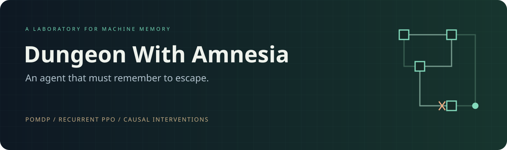
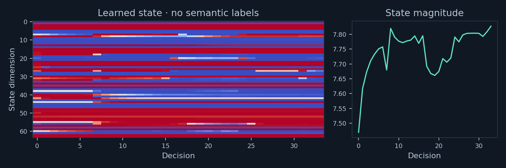
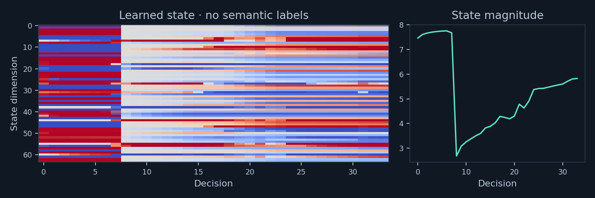
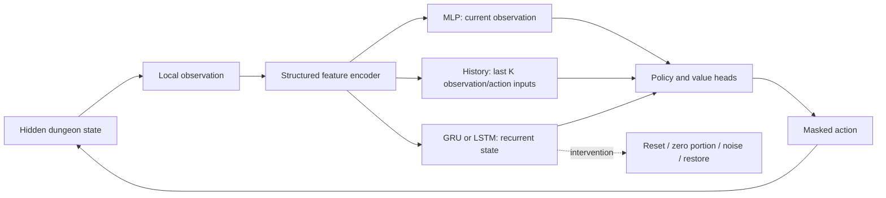
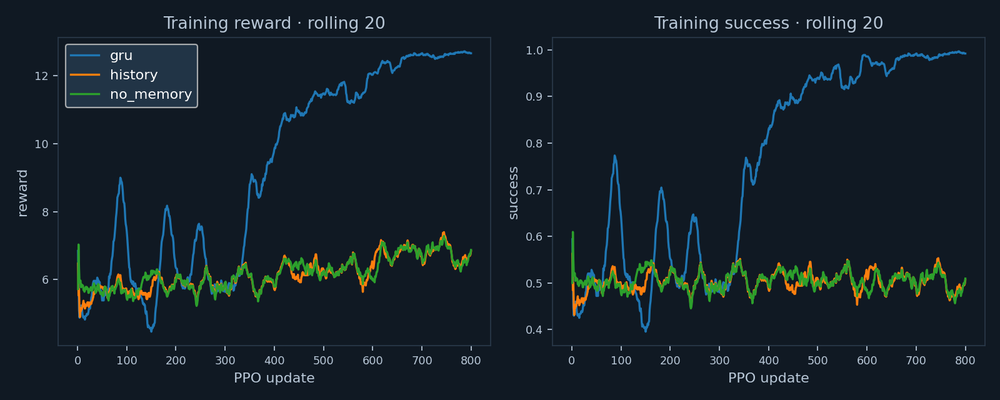
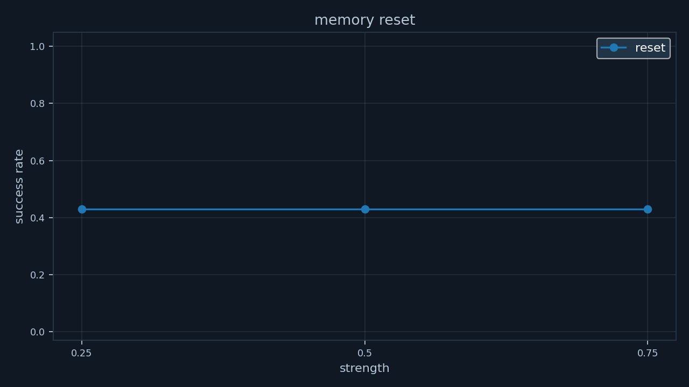
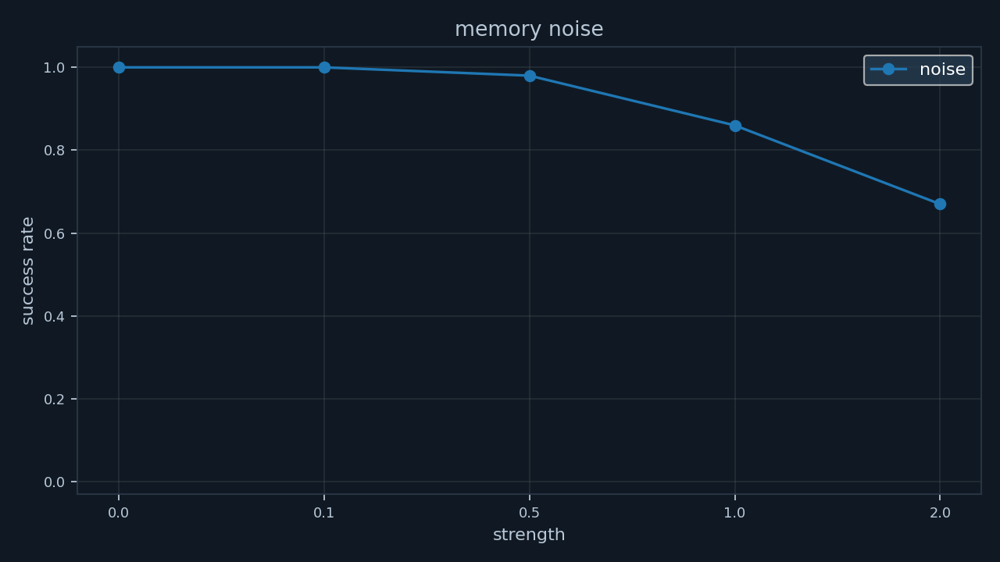

# Dungeon With Amnesia

**How much does intelligence depend on remembering what is no longer visible?**

A local research/demo project comparing feed-forward, short-history and recurrent PPO agents in partially observable text dungeons. Explore seeded maps, collect keys, confront unreliable clues, and intervene directly on an agent's retained state.

> The environment contains information the agent needs later but cannot observe again. Therefore successful behavior depends on preserving useful information through time.

**Measured showcase result:** a GRU trained with PPO escaped in **100/100 held-out showcase episodes**. Resetting its hidden state reduced success to **43/100**. See the [paired experiment records](results/ablation/ablation.csv), [deterministic replay](results/ablation/showcase_episode.json), and [full results report](docs/RESULTS.md).

This result concerns retention of a one-time **rune cue in a controlled detour**. It does not establish learned semantic memory of a door's location. Quick procedural exploration results are substantially weaker and are reported alongside it.

## The 60-second demonstration

1. Open the Streamlit app. Choose **Controlled showcase → GRU**.
2. Step once: a torch's rune disappears permanently from the policy's observation.
3. Run or step through the long detour to the red key and back to the locked door.
4. Open **Memory intervention → Replay verified deletion**.
5. Compare the control and treatment: identical dungeon, policy weights and action prefix; treatment memory alone is reset.
6. Examine the first action divergence, success/failure, full action timelines and neural-state heatmaps.

The recorded example uses seed **200001**, deletion after decision **8**, and diverges at the final seal decision. The intact agent succeeds; the reset agent fails. **33 decisions separate the initial cue from the final choice.** The path remains identical because the controlled task deliberately constrains navigation with turnstiles.

Demo recording slot: `docs/demo.gif` (optional future screen recording; no fabricated video is included). Real episode-state plots are already provided:




## Install and run

Python **3.11+**, CPU supported. The recorded experiments used Python 3.13 and PyTorch 2.10 CPU. No paid APIs, model downloads, language-model service, or ALFWorld installation is required. The dashboard works offline.

```bash
python -m venv .venv
```

Activate on Windows PowerShell:

```powershell
.\.venv\Scripts\Activate.ps1
```

Or on Linux/macOS:

```bash
source .venv/bin/activate
```

```bash
python -m pip install -r requirements.txt
python -m pytest -q
streamlit run dashboard/app.py
```

Open the local address printed by Streamlit, normally `http://localhost:8501`. Run commands from the repository root. For the exact tested library versions use `requirements-tested.txt` instead of `requirements.txt`. For CUDA, install the appropriate official PyTorch build and add `--device cuda` to training; GPU performance was not tested here.

**Checkpoints are not committed.** They are included in the original local workspace. A fresh clone can inspect all published results immediately; train the three showcase policies to enable learned-agent replay:

```bash
python experiments/compare_memory.py --config configs/showcase.json --root results/showcase --maps 100
python experiments/ablation.py --checkpoint results/showcase/gru/checkpoint.pt --maps 100
```

Until a checkpoint exists, the dashboard labels that architecture as an **untrained preview**. It never substitutes a scripted expert for a neural agent.

## Two complementary environments

| | Procedural exploration | Controlled memory showcase |
|---|---|---|
| Map | Seeded tree embedded in a 5–8 square grid | Fixed snake corridor, configurable detour |
| Rooms | Typically 8–20 | Detour length + 2 |
| Keys/doors | 1–4 necessary matched pairs | One red pair |
| Navigation | Free exploration, dead ends and return trips | Visible one-way turnstiles force outward/return motion |
| Memory demand | Exploration, door/key locations, vanished rune | Vanished rune retention isolated from navigation |
| Generalization | Unseen seeds and topologies, size, keys, clues | Unseen cue/description/clue realizations and longer delays |

All locks lie on the unique start-to-exit path. For each lock, its key is placed in the start-side component before that lock, so no key is trapped behind its own door. Earlier locks can gate later keys, creating solvable dependency chains. A BFS over `(position, inventory, opened locks)` independently certifies solutions in tests.

Each episode briefly reveals **Raven** or **Moon**. The cue is available only at reset, disappears after any action, and cannot be recovered by revisiting or inspecting. Reaching the exit requires invoking the matching seal; the wrong choice terminates the episode. Keys are persistent and reusable for their single corresponding door.

Clues claim that a colored key is in a room of a particular type. Reliability is configurable; false clues name a different type. The observer's trace records contradictions when a later key observation refutes a previous claim. Policies must learn from the same local inputs without receiving truth labels. The project does not claim the current trained policies learned sophisticated clue reasoning.

## Partial observability: the information boundary

The full state includes topology, room coordinates, all keys, locks, the correct seal, clues and their reliability outcomes, inventory, visited rooms, and agent position. The policy receives a **58-dimensional structured encoding** of the current room type, four visible passages, keys on the floor, inventory, current cue, current clue, and whether exit seals are visible. The same `Observation` renders readable text.

The encoder never sees absolute coordinates, room IDs, the complete graph, a visited-room flag, hidden clue truth, oracle actions, reward history, the observer's notebook, or the seed. Inventory is intentionally observable. History and recurrent agents additionally receive the previous action; the no-memory model explicitly ignores it.

This defines a finite-horizon POMDP: hidden state `s`, local observation `o = O(s)`, discrete action `a`, deterministic transition conditioned on the seeded dungeon, reward `R(s,a)`, and discount `γ`. The episode clock is hidden from the policy.

**Actions:** move north/south/east/west; unlock a door in each direction; take keys; invoke Raven/Moon; inspect; wait. Movement through a locked door fails until a matching key is held and the door is explicitly unlocked. All models share masks derived solely from the local observation. These suppress illegal actions and redundant inspect/wait actions during learned-policy runs. Human play can issue them, and the environment validates them independently.

```bash
python play.py --seed 42
```

## Architectures and PPO



The default small encoder uses two tanh layers, a 64-dimensional state and policy/value heads. The history window defaults to four observations paired with their preceding actions. LSTM is also implemented and tested. Parameter counts differ; this is an architecture comparison, not a matched-capacity study. A tokenized natural-language encoder can replace the structured encoder later; no huge language model is needed.

**Recurrent state flow matters.** During collection, the runner carries state between decisions and initializes it to zero at each episode. Each PPO epoch recomputes the entire episode from zero state under current weights. It never shuffles isolated recurrent timesteps or treats stored hidden states as independent training examples. Backpropagation therefore reaches the old cue. Padding is excluded from losses; true terminals bootstrap zero; time-limit truncations bootstrap the last observation value. Full episodes keep this implementation understandable but limit batch/episode scale.

PPO uses a clipped policy objective, generalized advantage estimation, value regression, entropy regularization, and gradient clipping. Training samples actions; reported evaluation uses **greedy actions**, which can expose loops masked by sampling during training. That train/evaluation difference is explicit, especially for the undertrained procedural baselines.

Default rewards: escape `+10`; necessary key `+1`; unlock `+0.5`; new room `+0.1`; every decision `−0.01`; invalid action `−0.05`; immediate pointless reversal `−0.02`; wrong seal `−2`. Rewards can be overridden under a config's `rewards` key. Keys/doors/discovery rewards occur once, preventing farming those bonuses. Immediate reversal is a measurable proxy for unnecessary backtracking, not a global optimality judgment.

## Training and reproducibility

```bash
python train.py --agent gru --seed 42
python train.py --agent no_memory --seed 42
python train.py --agent history --seed 42
python evaluate.py --checkpoint results/gru/checkpoint.pt --maps 100
python experiments/compare_memory.py
```

`configs/quick.json` runs 100 updates with 16 episodes per update. It verifies the end-to-end pipeline on a laptop and is **not sufficient for reliable procedural exploration**. `configs/showcase.json` runs 800 updates with 32 episodes and a 2→4→8→15-edge delay curriculum. `configs/full.json` specifies a larger 4,000-update procedural run; that full run has **not** been executed in the included results.

```bash
python train.py --agent gru --config configs/full.json --output results/full/gru
python train.py --agent lstm --updates 2 --output results/smoke/lstm
```

Python, NumPy, PyTorch and map-generation seeds are set; PyTorch deterministic algorithms are enabled and CPU threads are fixed to one. Train seeds occupy `[0,100000)`, validation `[100000,110000)`, test `[200000,210000)`. Same training seed produces the same map seed stream across architectures. Separate procedural seeds do not mathematically guarantee unique topologies in a finite generator; exact graph deduplication is future work.

Each run saves config/version metadata, loss/entropy/reward/success curves in JSON and CSV, and a local checkpoint. Evaluation saves per-episode outcomes, invalid actions, repeated visits, immediate backtracks, keys per step, and steps to success. Success intervals are Wilson 95% intervals over maps. Ablations include paired bootstrap intervals over success differences. **One training seed was used; these intervals do not measure optimization-seed variability.**

## Formal experiments

```bash
python experiments/compare_memory.py --root results/comparison --maps 50
python experiments/generalization.py --root results/comparison --maps 50
python experiments/dependency_distance.py --root results/showcase --maps 100
python experiments/ablation.py --checkpoint results/showcase/gru/checkpoint.pt --maps 100
```

Use `--skip-training` with `compare_memory.py` to evaluate existing checkpoints. Generalization evaluates same-size unseen maps, 6×6 and 8×8 maps, four keys, and low-reliability clues. Dependency experiments vary detours 2–30 edges and record actual cue-to-choice decision distance `2d+3`. Ablations reset at 25%, 50%, 75% of the **unmodified control episode length**, or inject seeded Gaussian noise halfway through. They clone the exact environment and policy state at the fork and hold greedy action selection fixed.





See [RESULTS.md](docs/RESULTS.md) for tables generated from the saved measurements, and [procedural comparison CSV](results/comparison/comparison.csv) for the weaker exploration results. Nothing in these plots is a proposed or fabricated number.

## Reading the memory visualizations correctly

There are **two maps**. Ground truth is a privileged debugging view. The discovered graph is reconstructed by a separate observer from local observations and successful relative moves. Unknown endpoints stay hidden. Notebook room numbers and relative positions never enter the learned policy.

There are also **two kinds of memory display**. The symbolic episodic trace is a human-readable notebook; the neural state is shown as a heatmap, norm, consecutive cosine similarity and within-episode PCA. PCA is descriptive and not aligned across episodes. Individual dimensions are **not labeled as semantic memories**.

Reset, partial zeroing, seeded noise and restore modify the actual retained tensor (both `h` and `c` for LSTM). History interventions change its finite observation buffer. Removing a symbolic event changes only the visualization. A no-memory agent has no state to delete. The interface reports a pair with no behavioral divergence honestly.

## Layout

```text
dungeon/        Generator, entities, POMDP, observations, rewards
agents/         Structured encoder, MLP/history/GRU/LSTM, oracle/random baselines
rl/             Full-episode rollout, GAE buffer, PPO, training
memory/         Observer trace, interventions, cloning runner, plots
experiments/    Comparisons, generalization, dependency and ablation studies
dashboard/      Streamlit research laboratory
configs/        Quick, full and showcase configurations
tests/          Solvability, isolation, state flow, PPO and dashboard tests
results/        Recorded configs, CSV/JSON metrics, real plots; ignored checkpoints
docs/           Banner, generated results, development record
```

## Limits and next experiments

- The compelling intervention demonstrates a binary vanished-cue memory, not a solved free-navigation dungeon. The quick procedural GRU does not outperform history; longer training and exploration-oriented curricula remain necessary.
- The showcase topology is fixed, its turnstiles reduce navigation to mostly forced actions, and the final cue is random. Map-seed generalization there concerns nuisance observations and cue values, not new layouts.
- Current graphs are grid-embedded trees. Cyclic maps, richer clue chains, multiple irreversible cues, and learned semantic map probes would increase realism.
- Hidden-state deletion also shifts the model off its learned state distribution. Noise dose response and zero-noise controls help, but do not prove a uniquely localized symbolic memory.
- The binary task permits chance success. No-memory is not expected to achieve zero success, and observed finite-sample rates need not equal exactly 50%.
- Full episodes are convenient for correct recurrent PPO but require memory proportional to horizon. A production-scale extension should use sequence minibatches with burn-in and carefully tested recurrent masks.
- Future work: multiple training seeds, capacity-matched baselines, sparse-reward runs, sampled-policy evaluation, withheld topology families, a text-token encoder, and optional Transformer memory. These are extensions, not placeholder core implementations.

## References

- Schulman et al., [Proximal Policy Optimization Algorithms](https://arxiv.org/abs/1707.06347), 2017.
- [PyTorch recurrent layers](https://docs.pytorch.org/docs/stable/generated/torch.nn.GRU.html).
- Shridhar et al., [ALFWorld](https://github.com/alfworld/alfworld), ICLR 2021. Conceptual inspiration for agents acting through text environments; this project neither clones its environment nor depends on its stack.

MIT licensed. See [LICENSE](LICENSE).
